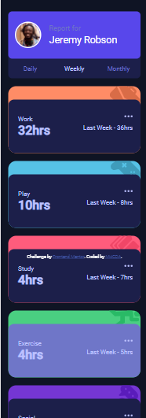

# Frontend Mentor - Time tracking dashboard solution

This is a solution to the [Time tracking dashboard challenge on Frontend Mentor](https://www.frontendmentor.io/challenges/time-tracking-dashboard-UIQ7167Jw). Frontend Mentor challenges help you improve your coding skills by building realistic projects. 

## Table of contents

- [Overview](#overview)
  - [The challenge](#the-challenge)
  - [Screenshot](#screenshot)
  - [Links](#links)
- [My process](#my-process)
  - [Built with](#built-with)
  - [What I learned](#what-i-learned)
  - [Useful resources](#useful-resources)
- [Author](#author)

## Overview

### The challenge

Users should be able to:

- View the optimal layout for the site depending on their device's screen size
- See hover states for all interactive elements on the page
- Switch between viewing Daily, Weekly, and Monthly stats

### Screenshot





### Links

- Solution URL: [Add solution URL here](https://your-solution-url.com)
- Live Site URL: [Add live site URL here](https://mhcdaeth.github.io/Time-tracking-dashboard/)

## My process

### Built with

- Semantic HTML5 markup
- CSS custom properties
- CSS Grid
- Mobile-first workflow


### What I learned

Use this section to recap over some of your major learnings while working through this project. Writing these out and providing code samples of areas you want to highlight is a great way to reinforce your own knowledge.

To see how you can add code snippets, see below:

the option menu made with this code below and its the biggest lesson ive learnd and no matter how much option is in it it doesnt affect the flow of actived menu and non active menu

```js
for (let p = 0 ; p <= options.length - 1; p++){

    options[p].onclick = function(){

        for(let i = 0; i <= options.length - 1; i++){
            options[i].classList.remove('select')

            if(i == p){
                options[p].classList.add('select')
            }

        }
    }

}
```

### Useful resources

- [W3Scholls](https://www.w3schools.com) - This helped me for on any referance i'd need  I really liked this pattern and will use it going forward.
- [MDN Docs](https://www.mdndocs.com) - This helped me for on any referance i'd need  I really liked this pattern and will use it going forward.


## Author

- Website - [MHCDA](https://mhcdaeth.github.io/mhcda-eth-web-v2.0/)
- Frontend Mentor - [@mhcdaeth](https://www.frontendmentor.io/profile/mhcdaeth)
- Twitter - [@mhcdaeth](https://twitter.com/mhcdaeth)
